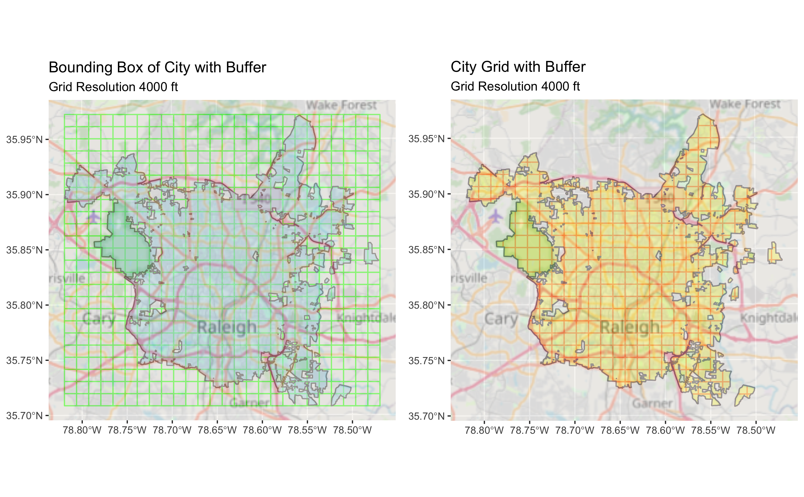

# Predicting Crime Hotspots with Cubist and Random Forests

# 

## Introduction

This github repository contains the reproducible data and code for the paper "Predicting Crime Hotspots with Cubist and Random Forests"
The contents are in github repo `completegraph/Raleigh`

## Technologies Used

This project uses `R` for computation and analysis.

## Data Sources

  1.  City of Raleigh Boundary in GEOJSON format.

  2.  Police Incident data is provided by the Open Raleigh Data Portal.

  3.  Potholes data is provided by Open Raleigh Data Portal.

  4.  Points of Interest data is provided by the Open Street Map Initiative in Shapefile format.

  5.  Household Median Income, Poverty, Unemployment and  data is provided from the US Census through the Censusreporter.org at the block group level.

## Code

  1.  All code is in the project_code directory which is further subdivided into 6 subdirectories Part 1 - Part 6 containing code in RMD files.
  
  2.  All code refers to data files in project_data subfolder.
  
  3.  The root folder of the project is specified in each RMD file and will need to be modified to the local directory.
  
## Results

   The HTML version of the paper is [RPubs](https://rpubs.com/Fixed_Point/848730)

   A Youtube video over of the project is at:  [Video](https://youtu.be/AWwT57oYL1U)

   Interactive maps are available in the repo for download.
   
*   project_data/CU_Demographics_Hotspots_20191231.html
*   project_data/CU_POI_Hotspots_20191231.html
*   project_data/RF_Demographics_Hotspots_20191231.html
*   project_data/RF_POI_Hotspots_20191231.html
   
   
   
## License

We use a shared copyright model that enables all contributors to maintain the
copyright on their contributions.

This software is licensed under the BSD-3-Clause license. See the
[LICENSE](LICENSE) file for details.
